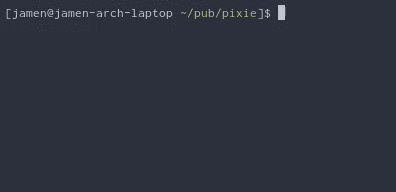

# bench

Better defaults for [Benchmark.js](https://github.com/bestiejs/benchmark.js/).



## Install

```sh
npm i @jamen/bench
```

## Usage

### `benchmark()`

Create a [`Benchmark.Suite`](https://benchmarkjs.com/docs) with event listeners that report for you.  Also reports the CPU and memory. Use `.add` calls then `.run` to perform the benchmarks.

```js
let bench = benchmark()

bench.add('foobar', () => {
  foobar()
})

bench.run()
```